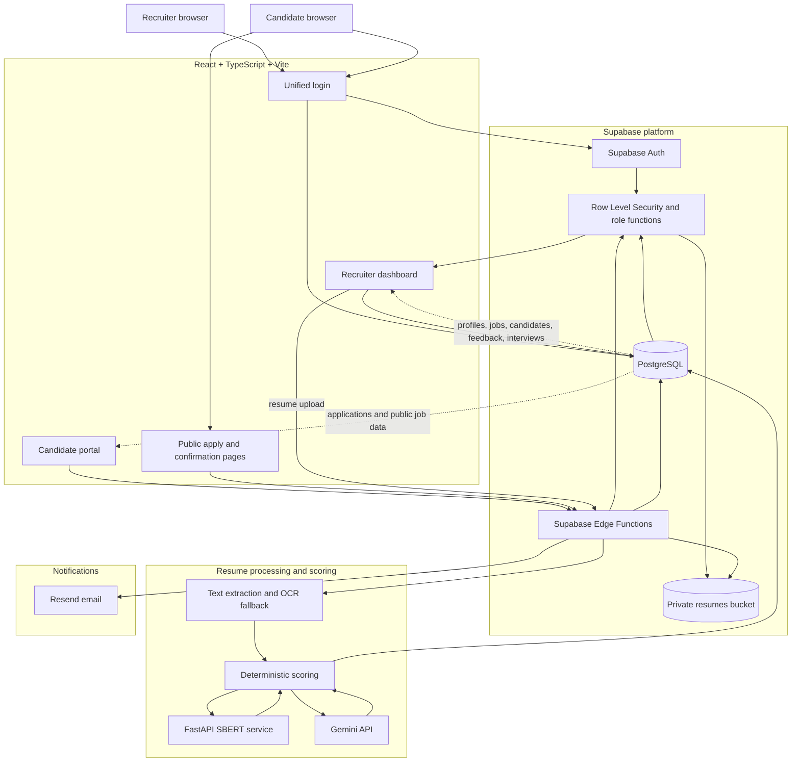

# Current system architecture

```mermaid
flowchart TB
    recruiter[Recruiter browser]
    candidate[Candidate browser]

    subgraph frontend[React + TypeScript + Vite]
        login[Unified login]
        dashboard[Recruiter dashboard]
        portal[Candidate portal]
        public[Public apply and confirmation pages]
    end

    subgraph supabase[Supabase platform]
        auth[Supabase Auth]
        db[(PostgreSQL)]
        rls[Row Level Security and role functions]
        storage[(Private resumes bucket)]
        edge[Supabase Edge Functions]
    end

    subgraph processing[Resume processing and scoring]
        extract[Text extraction and OCR fallback]
        scoring[Deterministic scoring]
        sbert[FastAPI SBERT service]
        gemini[Gemini API]
    end

    subgraph notifications[Notifications]
        resend[Resend email]
    end

    recruiter --> login
    candidate --> login
    candidate --> public
    login --> auth
    login --> db
    dashboard --> db
    portal --> edge
    public --> edge

    auth --> rls
    db --> rls
    rls --> dashboard
    rls --> storage
    edge --> rls
    edge --> db
    edge --> storage

    dashboard -->|resume upload| edge
    edge --> extract
    extract --> scoring
    scoring --> sbert
    scoring --> gemini
    sbert --> scoring
    gemini --> scoring
    scoring --> db
    edge --> resend

    db -. profiles, jobs, candidates, feedback, interviews .-> dashboard
    db -. applications and public job data .-> portal
```
